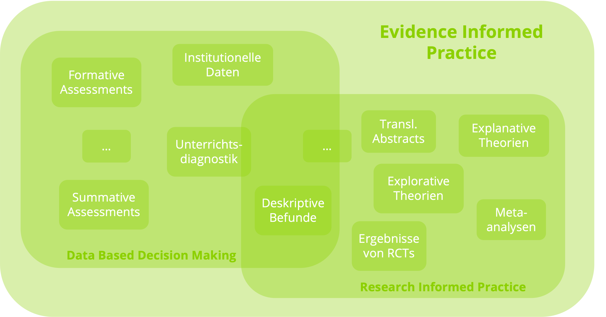
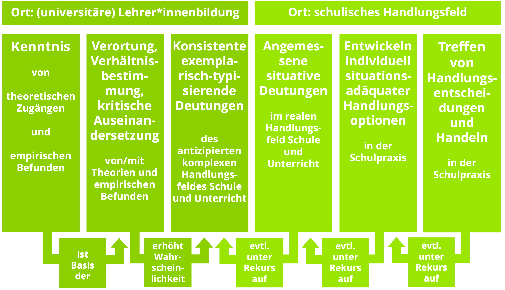

class: hide_logo center middle
<script src="https://kit.fontawesome.com/994a28441d.js" crossorigin="anonymous"></script>
```{r setup, include=FALSE}
options(htmltools.dir.version = FALSE,
        htmltools.preserve.raw = FALSE)
knitr::opts_chunk$set(
  fig.width=9, fig.height=3.5, fig.retina=3,
  out.width = "100%",
  cache = FALSE,
  echo = TRUE,
  message = FALSE, 
  warning = FALSE,
  hiline = TRUE
)
```

```{r, echo = F}
library(xaringanthemer)

extra_css <- 
  list(
    ".cit"  = list("font-size" = "70%",
                   "color" = "#8cd000"),
    ".phg" = list("color" = "#8cd000"),
    ".em05" = list("font-size" ="0.5em"),
    ".em06" = list("font-size" ="0.6em"),
    ".em07" = list("font-size" ="0.7em"),
    ".em08" = list("font-size" ="0.8em"),
    ".em09" = list("font-size" ="0.9em"),
    ".em11" = list("font-size" ="1.1em"),
    ".em12" = list("font-size" ="1.2em"),
    ".em13" = list("font-size" ="1.3em"),
    ".em14" = list("font-size" ="1.4em"),
    ".em15" = list("font-size" ="1.5em"),
    ".large" = list("font-size" = "160%"))

style_mono_accent_inverse(
  base_color = "#8cd000",
  white_color = "#FFFFFF",
  black_color = "#272822",
  extra_css = extra_css)

library(xaringanExtra)
use_logo(
  image_url = "https://apps.samuel-merk.de/data/PHK_2018_Logo_V1_FARBE_NUR_PH.svg",
  width = "80px",
  position = xaringanExtra::css_position(top = "1em", right = "1em")
)

```


# .white[Potentiale der Schulpädagogik]

.em14[`r fontawesome::fa("lightbulb", fill = "#ffff", height = "150px")` ]

### .white[in Forschung und Lehre.]

 &nbsp;&nbsp;&nbsp;&nbsp;
 

---  
.em14[.white[Samuel Merk | PH Karlsruhe]]  
Folien: bit.ly/merk037

---
# Übersicht:

.em14[
* Was wird unter Schulpädagogik verstanden?
* Mein Verständnis von Schulpädagogik
* Zwei ausgewählte Potentiale der Schulpädagogik
    * Anbahnung evidenz-informierter Praxis
    * Entwicklung meta-reflektiver Professionalität]

---
# Schulpädagogik

### Definitonsansätze
.em13[
* Schulpädagogik gilt als außerwissenschaftlichen Ursprungs .cit[(Rothland, 2019)]
* Speziell gelagerte Sub-, Teil- oder Bereichsdisziplin .cit[(Esslinger-Hinz &Sliwka 2011; Haag & Rahm 2013; Ofenbach, 2011)]
* Integrations- und Vermittlungswissenschaft .cit[(Bohl, Harant & Wacker 2015; Wellenreuther 2011)]
* Wissenschaft der Lehrerinnen- und Lehrerprofession .cit[(Gläser-Zikuda 2008; Haag & Rahm 2013))]
]

---
# Schulpädagogik
### Kritik dieser Ansätze

.em13[
* Wenn eine Disziplin als die »primäre Einheit interner Differenzierung der Wissenschaft« definiert ist .cit[(Stichweh, 1994; S. 17)], die sich u.a. durch einen »homogenen Kommunikationszusammenhang«, und einen »akzeptierten Korpus wissenschaftlichen Wissens« .cit[(ebd.)] kennzeichnet, ist die Schulpädagogik keine (Sub-)Disziplin
* Schulpädagogik als Vermittlungswissenschaft definiere diese als Bildungsprogramm .cit[(Rothland, 2019)]
* Schulpädagogik als Forschung von der Praxis für die Praxis sei paradox: Wissenschaftliche Eigenständigkeit kann nicht durch ein außerwissenschaftliches Kriterium generiert werden .cit[(ebd.)]
]

---
# Mein Verständnis von Schulpädagogik
.em13[
* Auffassung als Teildisziplin kaum haltbar
* Auffassung als Profession .cit[(Keck, 1999)] kohärent, aber wenig intuitiv
* Mein Vorschlag: Bezeichnung eines Inter-/Trans-/Multidisziplinären Forschungs*feldes*
    * Eher Anwendungs- als Grundlagenforschung
    * Starker Fokus auf Unterrichts-, Professionalitäts- und Professionalisierungsforschung
    * Zusätzliche Aufgabe der Metareflexion <!-- .cit[(Cramer, Harant, Merk & Emmerich, 2019)] -->
]

---
class: center middle
# (Zwei ausgewählte) Potentiale einer so verstandenen Schulpädagogik

---
## Anbahnung einer evidenz-informierten Praxis
--

### Definition: Evidenz-Informierte Praxis
```{r, echo = F, out.width="60%", fig.cap='Nach Brown, Schilkamp und Hubers, <span style="color:#8cd000"> (2017) </span>. Eigene Darstellung.', fig.align='center'}

```

---
## Anbahnung einer evidenz-informierten Praxis
### Evidenz kann menschliche Wahrnehmung (teilweise) entzerren 
<br><br>
.pull-left[
<center>
```{r, echo=FALSE, fig.cap="Ebbinghaustäuschung<br>(Massaro & Anderson, 1971)", out.width="30%"}
knitr::include_graphics("img/Ebbinghaus.png")
```
</center>
]

.pull-right[
<center>
<video controls="controls" width="350" height="200" name="Video Name">
  <source src="https://apps.samuel-merk.de/data/MBI.mov">
</video><br>
(Kleinman & Anandarajan, 2011)
</center>
]

---
# Potentiale Evidenz-Informierter Praxis
## Meine aktuelle Forschung

* **Drittmittelprojekte** zu digital gestütztem Assessment
    * *Vom Testergebnis zur pädagogischen Maßnahme* (Biaesch Stiftung)
    * *Campus Community Partnership zur digitalen Lernverlaufsdiagnostik* (Robert Bosch Stiftung)
    * *Nachhaltige Integration von fachdidaktischen digitalen Lehr-Lern-Konzepten - Praxistransfer* (Stiftung Innovation in der Hochschullehre)
    * *Digitales, kompetenzorientiertes Prüfen an der Pädagogischen Hochschule Karlsruhe* (Stiftung Innovation in der Hochschullehre)

--

* **Promotionen**
    * *On the Role of Confirmation Bias in Evidence-Informed Teaching* (Kirstin Schmidt) 
    * *Using Anchor Effects to Communicate Effect Sizes to Lay-Persons* (Kristina Bohrer)

---
# Potentiale Evidenz-Informierter Praxis
## Implikationen für die Lehre
.em13[
* Einbezug von Primärforschung in die Lehre
* Stärkung der Research und Data Literacy 
    * Studentische Forschungsprojekte
    * Spezialisierte Veranstaltungen
* Arbeit mit Video- und Textfällen
* Daten- und -videobasiertes Feedback im Praktikum
]
---
## Potential: Anbahnung einer metareflektiven Professionalität
```{r, echo = F, out.width="60%", fig.align='center', fig.cap="Cramer, Harant, Merk & Emmerich  (2019)"}

```

---
# Potentiale der Entwicklung meta-reflektiver Professionalität
## Forschung
* Drittmittelprojekt (Antrag in Vorbereitung): *Fostering Evaluative Epistemic Beliefs About Educational Knowledge in Teacher Education*
* Publikationsprojekte
    * Rosman, T., & Merk, S. (2021). Teacher’s Reasons for Trust and Distrust in Scientific Evidence: Reflecting a “Smart But Evil” Stereotype? AERA Open, 7, 233285842110285
    * Rosman, T., Seifried, E., & Merk, S. (2020). Combining Intra- and Interindividual Approaches in Epistemic Beliefs Research. *Frontiers in Psychology 11*.
    * Rosman, T., Schlag, M., & Merk, S. (2020). Das Zusammenspiel epistemischer Überzeugungen und der Bedeutsamkeitseinschätzung pädagogisch- psychologischen Wissens im Lehramtsstudium: Längsschnittliche und querschnittliche Analysen. *Psychologie in Erziehung und Unterricht 67*(3), 164– 177.

---
# Entwicklung meta-reflektiver Professionalität
## Implikationen für die Lehre
.em13[
* Offene Diskussion der epistemologischen Charakteristika der jeweiligen Inhalte
* Offenlegung der inhaltlich inhärenten Sicht auf die Theorie-Praxis-Relationierung
* Umfangreiche »Exemplarisch-typisierende konsistente Deutungen«
    * Analysen eigener/fremder Unterrichtsvideos
    * Analysen von Unterrichtsmaterialien
]

---
class: center, middle, hide_logo
background-image: url(https://imagizer.imageshack.com/img924/1061/buQNhG.png)
background-size: cover
# Herzlichen Dank für Ihre Aufmerksamkeit!

